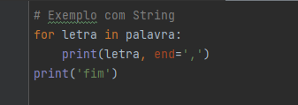
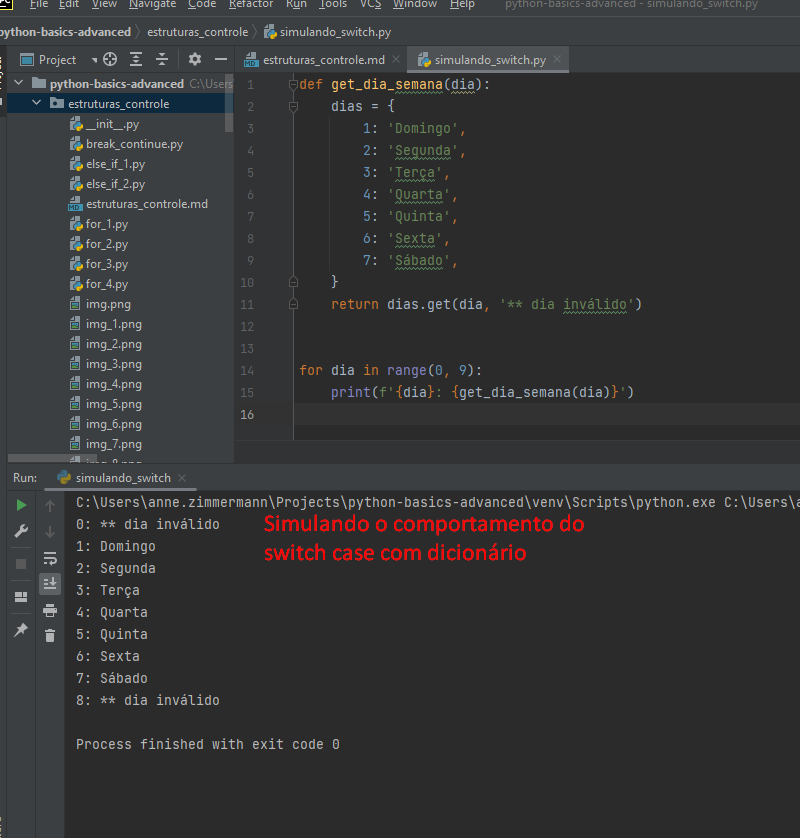
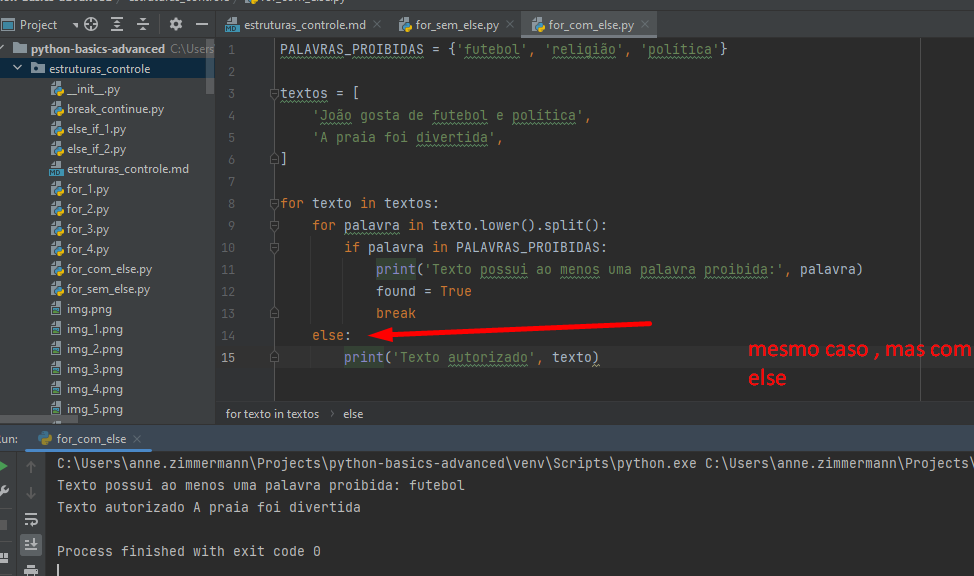
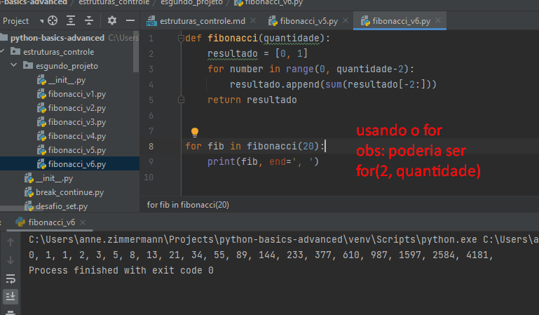

# Exemplo de IF com range 

# While: usado em quantidades indefinidas de execução.
A condição é executada dentro do bloco.

# For
Usado em quantidade determinada de informações (set, lista, tupla)

# Percorrer String

# Percorrer Lista

# Percorrer tupla

# Percorrer SET

# Dicionario com for

Mas é limitado ao escopo essa visibilidade

# Continue

# For e Else

# Simulando o Switch(No Python não tem Swith Case)

# Importante : Criar constantes com letra maiúscula

For sem Else

# For com else

# Desafio resolvido com listas
Lembrar que os indices na lista estão sendo chamados na ordem reversa (último para primeiro)

[... -3, -2, -1]

## Recursividade - método que chama ele mesmo
Exemplos de uso de Recursividade.

Usando ternário e recursividade

