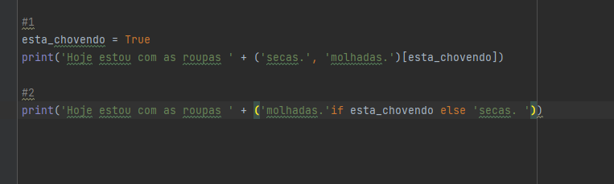
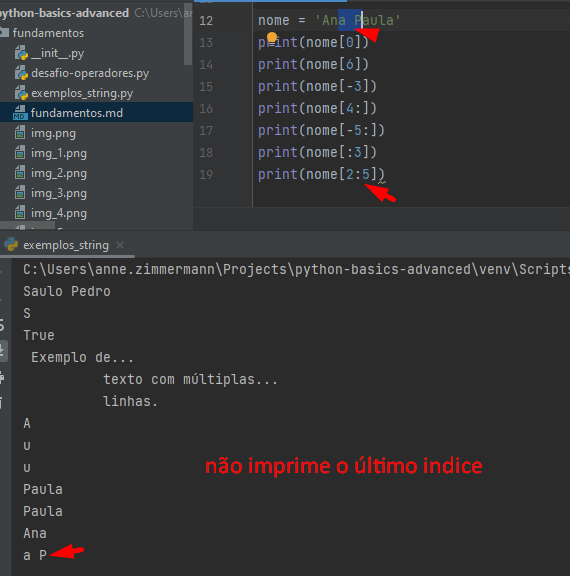
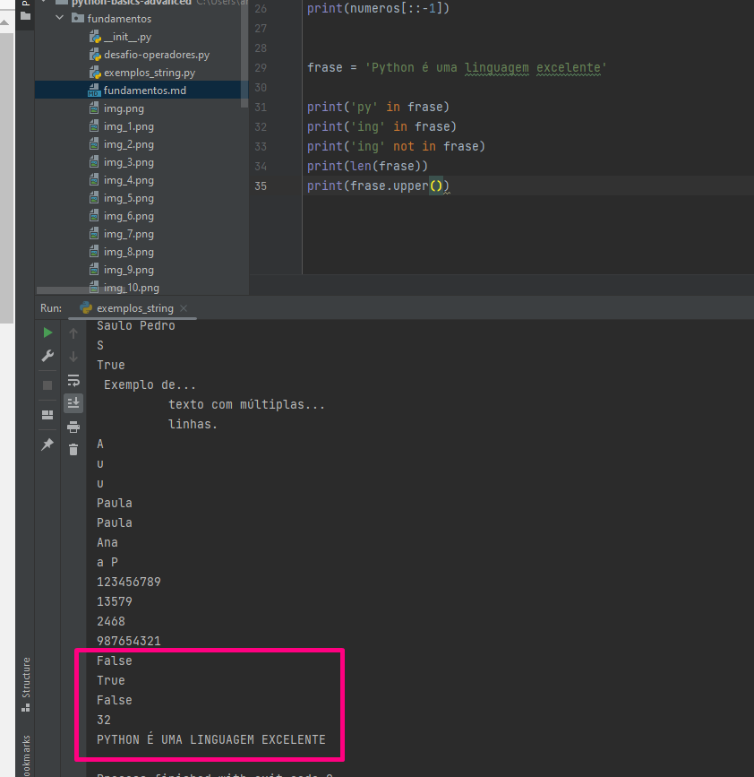
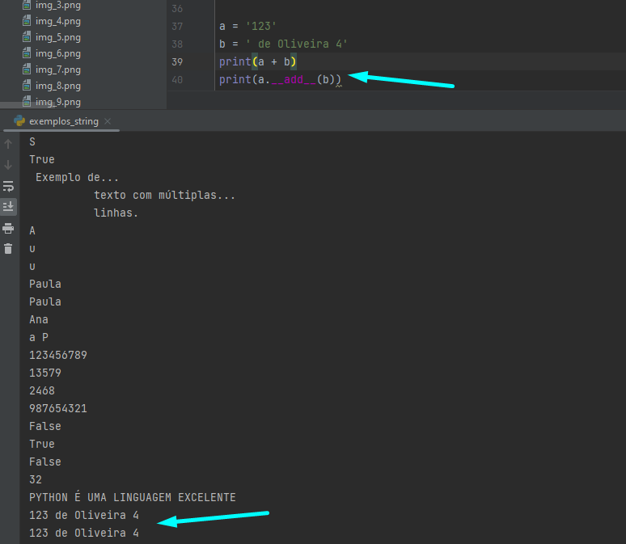
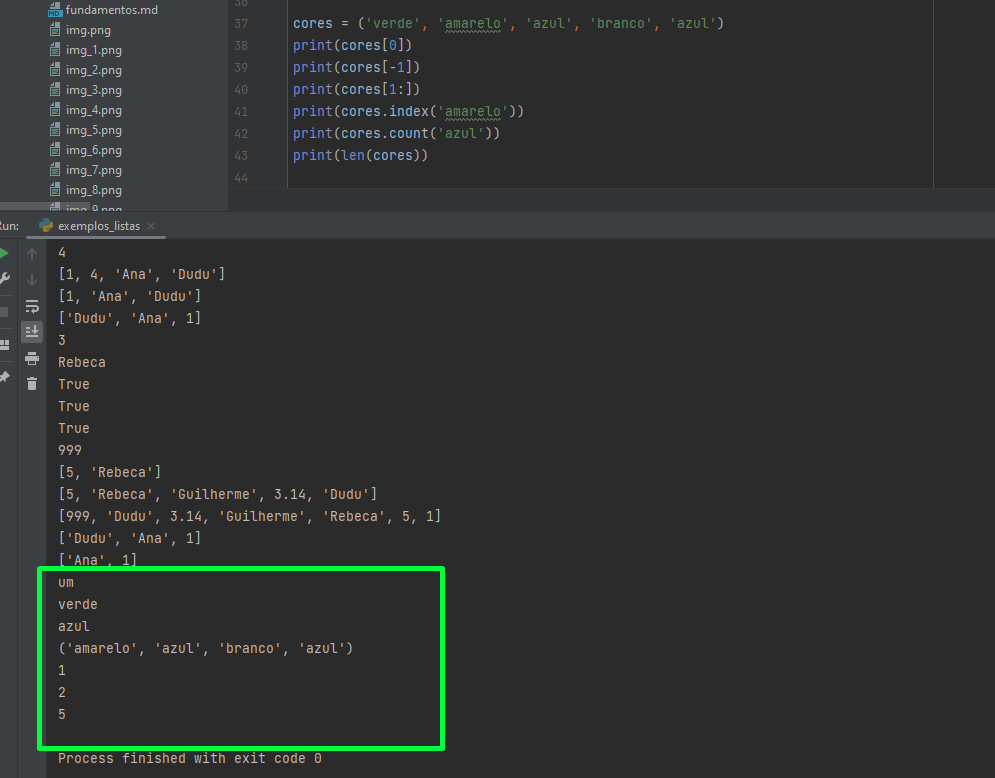

# Primeiros Exemplos

- Não é recomendado o uso de ;
- Uma sentença por linha
- Python se importa com identações e quebras de linhas

- No Python lista é dinâmica (indexada)

-Dicionario (key - value)

- None é equivalente ao null ou undefined
- 

# Variáveis

- Python é dinâmicamente e fortemente tipada, pois permite que troquemos o dado de determinada variável, porém ao realizar uma
função e informarmos tipos diferente, ele aponta erro.


- Quando criamos uma variável no Python não definimos o tipo, o interpretador
vai descobrir que tipo de variável é.


# Comentários


- '#' Comentário de uma linha
- '''' ou """" - Comentário múltiplas linhas - 3 aspas simples ou duplas

# Operadores Aritméticos

- São operadores binários (2 operandos)
- Nomenclatura infix

- 

# Exercícios


# Operadores de Atribuição


# Desafio 2


# Operadores Unários

- Não temos o ++ ou o -- no Python, apenas += ou -=
# Operadores Ternários


# Operadores de Membro
- Quando queremos saber se determinado elemento é membro de uma lista


# Operadores de Identidade


# Builtins
- Temos o type, print, dir (dir recebe um objeto e retorna uma lista de Strings)


# Conversão de tipos


# Tipos Numéricos 

- int, float 
- 
- 


- 
- 


-   
- 
- 
- 


# Operador de Membro com String


# Operadores Mágicos




# Listas

Em Python as listas são uma sequência mutável, ou seja, podemos adicionar ou remover (dinâmica).
Podem ter diversos tipos (heterogeneo).


# Tuplas

Ela não pode ser modificada, não conseguimos excluir, atribuir e alterar.




# Dicionarios


# Conjuntos (SETS)

É apenas valores, como a lista, porém ambas são diferentes.
Lista é indexada e aceita repetições e , por padrão, obedece a ordem de inserção.
O Set não garante a ordem, não é indexado e não aceita repetições (mais rápido que a lista)


# Interpolação

- 1 - Forma antiga (menos recomendada)


- 2 - Com format


- 3 - F-String


# Executar classe Python no terminal


````python area_circulo_v1.py````


# Função MATH


# Input e conversão de String


# Módulo

Particionando em arquivos, dividindo o projeto em package e módulos para termos um projeto modularizado


 
roda o módulo


Código em Python é definido com sentença de código.
Identação define um bloco de código.


# Função sem retorno no Python

def - palavra reservada para criação de função


``python``
``area_circulo_v1.circulo(10)``


# Funcão com retorno


# If - elif - else

