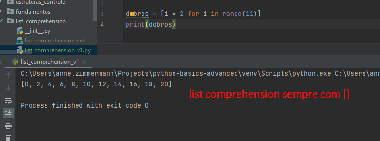
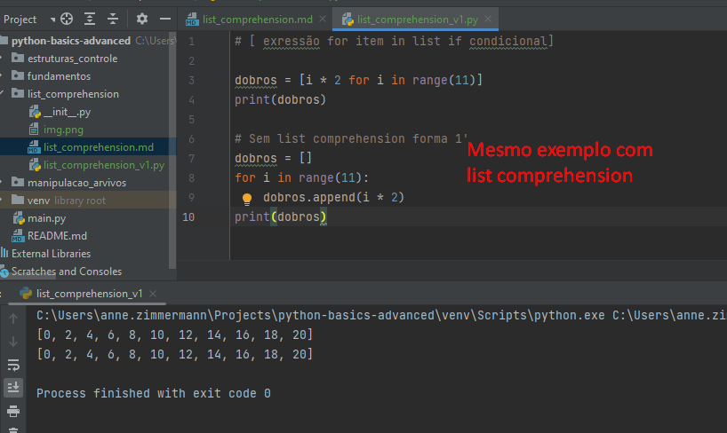
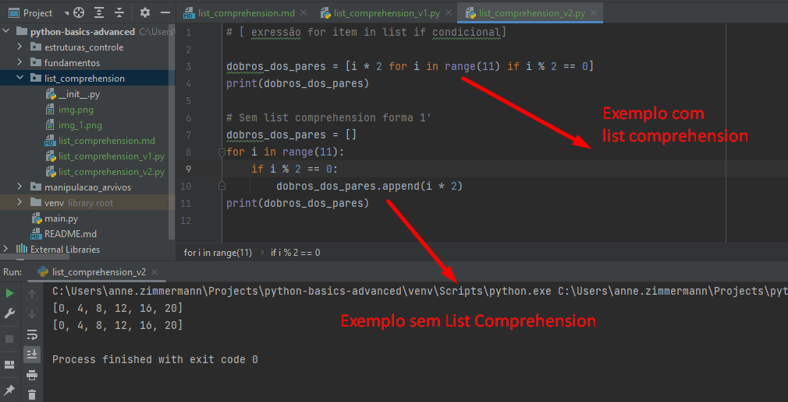
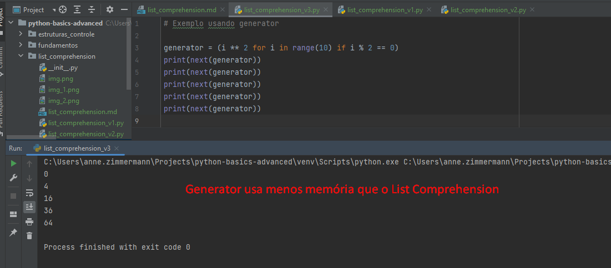
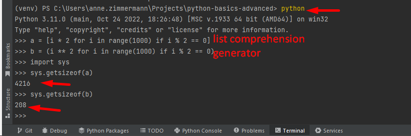
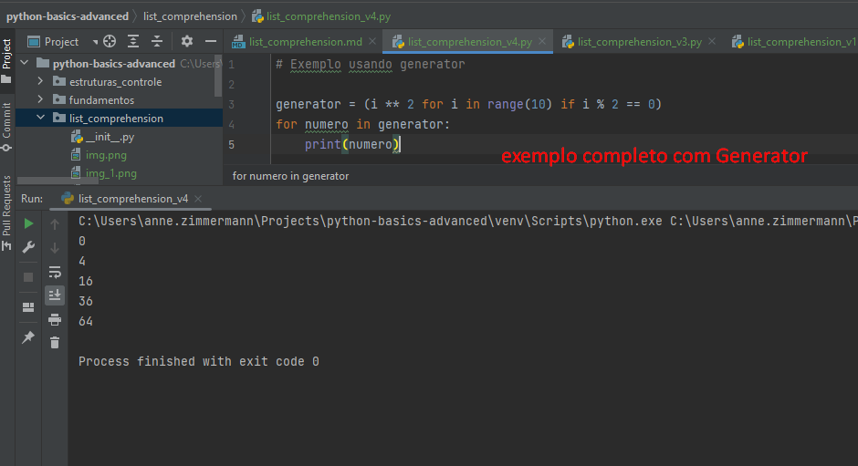
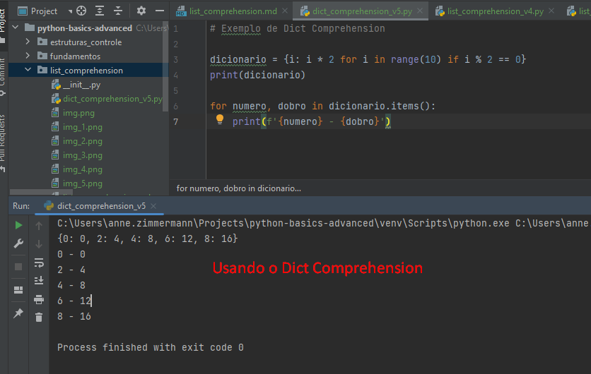
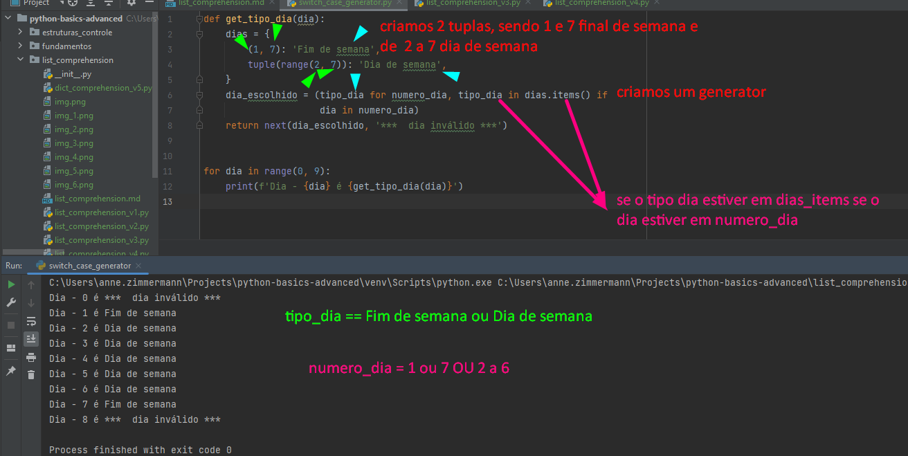

# Criando listas a partir de uma única linha com List Comprehension





# Exemplo 2 usando List Comprehension (e não usando também)




# Exemplo 3 usando generators
Generator gera os dados sob demanda



# Comparando List Comprehension x Generator
List Comprehension gera a lista completa e o Generator gera sob demanda






# Simulando o switch case com Generator 

Complexo:



````

def get_tipo_dia(dia):
    dias = {
        (1, 7): 'Fim de semana',
        tuple(range(2, 7)): 'Dia de semana',
    }
    dia_escolhido = (tipo_dia for numero_dia, tipo_dia in dias.items() if
                     dia in numero_dia)
    return next(dia_escolhido, '***  dia inválido ***')
# Vai retornar o dia escolhido, senão retorna inválido

for dia in range(0, 9):
    print(f'Dia - {dia} é {get_tipo_dia(dia)}')


```
