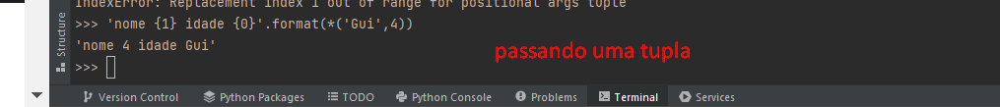
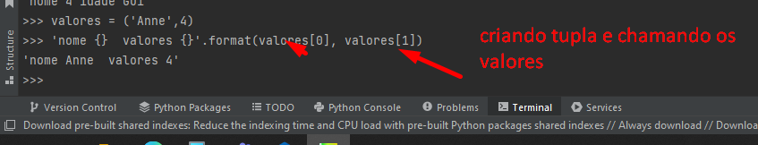
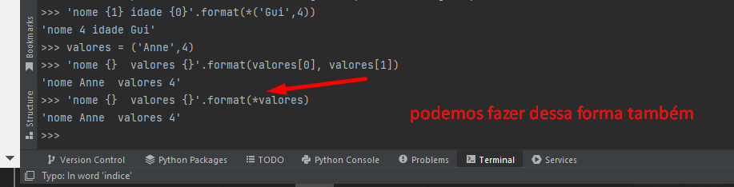
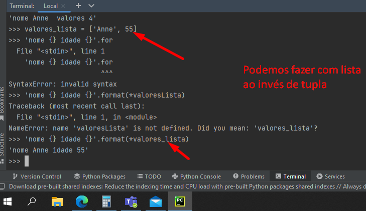

# Exemplo chamando uma tupla no .format

Criando uma tupla e chamando os valores por indice

Criando uma lista e chamando os valores dela 

# Importante.
Quando você lê um arquivo você usa recursos do sistema operacional então sempre que você
aloca recursos dentro do seu programa é importante que você feche esses recursos.

# Fechamento de forma explícita

