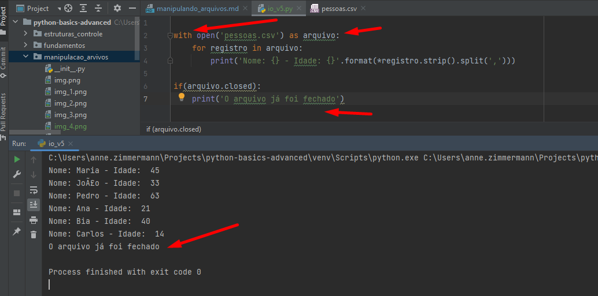
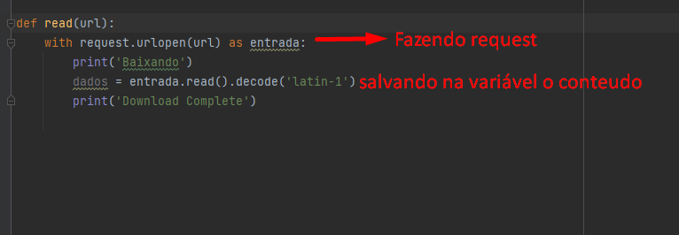

# Exemplo chamando uma tupla no .format

Criando uma tupla e chamando os valores por indice

Criando uma lista e chamando os valores dela 

# Importante.
Quando você lê um arquivo você usa recursos do sistema operacional então sempre que você
aloca recursos dentro do seu programa é importante que você feche esses recursos.

# Fechamento de forma explícita

Exemplo mais simples de leitura de arquivo csv

# Leitura simples com streaming, ou seja, consumindo os dados a medida que são utilizados, 
# sem alocação de memória

# Usando o strip na leitura de arquivos

# Usando try e finally

# Fechamento de arquivo de forma implícita com WITH

O with pode ser usado em outras situações, como conexão com BD

# Escrevendo em arquivos

# Usando o módulo CSV para leitura de arquivos - 
Esse leitor já dá pra gente o arquivo já todo mastigado porque ele sabe que é um 
arquivo CSV então fica mais fácil para a gente consumir.
Já vai trazer todas as linhas separadas, vai quebrar cada um dos atributos porque ele 
sabe que foi separado por vírgula.

# Fazendo requests de arquivos no Python

# Desafio IBGE - Anne

# Desafio IBGE - Resolução apresentada

# Desafio IBGE - Versão Anne Upgrade

